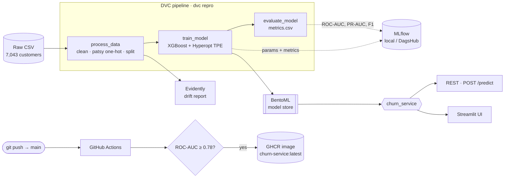

<div align="center">

# 📉 Telco Customer Churn — MLOps

**A production-shaped, end-to-end machine learning pipeline that predicts customer churn — from raw CSV to a containerized prediction API, with reproducible training, experiment tracking, CI/CD, and drift monitoring.**

[](https://github.com/vigneshsabapathi/telco-customer-churn-mlops/actions/workflows/test_code.yaml)
[](https://github.com/vigneshsabapathi/telco-customer-churn-mlops/actions/workflows/deploy_app.yaml)


<sub>XGBoost · DVC · Hydra · MLflow · Hyperopt · BentoML · Streamlit · Evidently · GitHub Actions · GHCR</sub>

</div>

---

## Overview

Roughly **1 in 4** telco customers churn. This project trains a gradient-boosted classifier to flag at-risk customers from 19 account attributes, and wraps it in the full operational scaffolding you'd expect around a real model: a reproducible data/training pipeline, tracked experiments, a versioned model registry, a REST + UI serving layer, automated tests, container delivery, and production drift monitoring.

It is built as a **portfolio-grade reference implementation** — every layer is wired up and tested, not stubbed.

| | |
|---|---|
| **Problem** | Binary classification — will a customer churn? (`Churn ∈ {0,1}`, ~26.5% positive) |
| **Data** | [IBM Telco Customer Churn](https://github.com/IBM/telco-customer-churn-on-icp4d) — 7,043 customers × 21 columns |
| **Model** | XGBoost, hyperparameters tuned with Hyperopt TPE; `scale_pos_weight` handles the ~3:1 imbalance |
| **Performance** | **≈ 0.84 ROC-AUC** on the held-out test split · a **0.78 ROC-AUC gate** blocks any deploy below floor |
| **Serving** | BentoML service (`/predict`) + Streamlit UI, packaged as a Docker image on GHCR |

## Architecture



## Tech stack

| Concern | Tool | Where |
|---|---|---|
| **Config** | [Hydra](https://hydra.cc) — composable YAML groups, CLI overrides | `config/` |
| **Data & model versioning** | [DVC](https://dvc.org) — pipeline DAG + reproducible stages | `dvc.yaml` |
| **Model** | [XGBoost](https://xgboost.ai) + [Hyperopt](http://hyperopt.github.io/hyperopt/) TPE search | `training/src/train_model.py` |
| **Experiment tracking** | [MLflow](https://mlflow.org) (local by default, [DagsHub](https://dagshub.com) opt-in) | `training/src/helper.py` |
| **Feature encoding** | [patsy](https://patsy.readthedocs.io) — formula-based one-hot (19 raw → 31 columns) | `training/src/process.py` |
| **Data validation** | [Pandera](https://pandera.readthedocs.io) schema + [Deepchecks](https://deepchecks.com) suites | `training/tests/` |
| **Serving** | [BentoML](https://bentoml.com) service + runner | `application/src/create_service.py` |
| **UI** | [Streamlit](https://streamlit.io) | `application/src/create_app.py` |
| **Monitoring** | [Evidently](https://evidentlyai.com) data-drift report | `monitoring/drift_report.py` |
| **CI/CD** | GitHub Actions → [GHCR](https://ghcr.io) container registry | `.github/workflows/` |
| **Quality** | pytest · black (79) · flake8 · isort · pre-commit | `pyproject.toml`, `.pre-commit-config.yaml` |

## Quickstart

> **Prerequisites:** Python 3.10–3.12, git. Docker is optional (only needed to build/run the container image).

```bash
# 1. Clone
git clone https://github.com/vigneshsabapathi/telco-customer-churn-mlops.git
cd telco-customer-churn-mlops

# 2. Create the venv + install everything (single source of truth: requirements.txt)
make install          # or: python -m venv .venv && .venv/Scripts/python -m pip install -r requirements.txt

# 3. Get the data (DVC-tracked; or download the IBM CSV into data/raw/)
make pull_data        # needs a configured DVC remote
#   ...no remote? grab it directly:
#   curl -fsSL -o data/raw/Telco-Customer-Churn.csv \
#     https://raw.githubusercontent.com/IBM/telco-customer-churn-on-icp4d/master/data/Telco-Customer-Churn.csv

# 4. Run the full pipeline (process → train → evaluate)
dvc repro             # or: python training/src/main.py

# 5. Serve it
python application/src/save_model_to_bentoml.py
bentoml serve application.src.create_service:service --port 3000
```

<sub>Windows: the venv interpreter is `.venv\Scripts\python.exe`. Use it explicitly for project commands.</sub>

### Predict via the API

```bash
curl -X POST http://localhost:3000/predict \
  -H "Content-Type: application/json" \
  -d '{
        "gender": "Female", "SeniorCitizen": 0, "Partner": "Yes", "Dependents": "No",
        "tenure": 2, "PhoneService": "Yes", "MultipleLines": "No",
        "InternetService": "Fiber optic", "OnlineSecurity": "No", "OnlineBackup": "No",
        "DeviceProtection": "No", "TechSupport": "No", "StreamingTV": "Yes",
        "StreamingMovies": "Yes", "Contract": "Month-to-month", "PaperlessBilling": "Yes",
        "PaymentMethod": "Electronic check", "MonthlyCharges": 89.5, "TotalCharges": 179.0
      }'
# → [0.78]   (churn probability)
```

### Or use the UI

```bash
streamlit run application/src/create_app.py
```

## Project structure

```
telco-customer-churn-mlops/
├── config/                     # Hydra config groups
│   ├── main.yaml               #   composition root (split, tracking, monitoring)
│   ├── process/                #   feature sets — with_contract (19) | numeric_only (4)
│   └── model/xgb_default.yaml  #   XGBoost + hyperopt search space
├── training/
│   ├── src/
│   │   ├── process.py          # clean + patsy encode + stratified split   ─┐
│   │   ├── train_model.py      # XGBoost + Hyperopt TPE                      ├─ DVC stages
│   │   ├── evaluate_model.py   # metrics.csv (ROC-AUC, PR-AUC, F1)          ─┘
│   │   ├── helper.py           # BaseLogger (MLflow, local/remote)
│   │   └── main.py             # run all three stages via Hydra
│   └── tests/                  # pytest-steps · Pandera · Deepchecks · drift
├── application/
│   ├── src/
│   │   ├── create_service.py   # BentoML service — Pydantic in, ndarray out
│   │   ├── save_model_to_bentoml.py
│   │   └── create_app.py       # Streamlit UI
│   └── tests/                  # service logic + live endpoint tests
├── monitoring/drift_report.py  # Evidently drift report → reports/drift.{html,json}
├── .github/workflows/          # test_code (PR) · deploy_app (push → GHCR)
├── dvc.yaml                    # pipeline DAG
├── bentofile.yaml              # container build spec
├── requirements.txt            # single source of truth for deps (CI parity)
└── Makefile                    # install · pull_data · process · test · clean
```

## Configuration (Hydra)

Config is composed from groups, so swapping a feature set or tweaking the split is a one-liner — no code edits:

```bash
# Train on the 4-feature numeric-only variant instead of the full 19
python training/src/main.py process=numeric_only

# Larger test split + heavier hyperopt budget
python training/src/main.py split.test_size=0.3 model.max_evals=100
```

**Experiment tracking** defaults to a local `./mlruns`. To log to a remote DagsHub MLflow server, set `tracking.remote: true` in `config/main.yaml` and export credentials as **environment variables** (never committed):

```bash
export MLFLOW_TRACKING_USERNAME=...
export MLFLOW_TRACKING_PASSWORD=...
```

## CI/CD

Two workflows, both runnable manually from the Actions tab:

- **`test_code.yaml`** (on PR → `main`) — installs deps, fetches the dataset, runs `process` + `train`, executes the training tests, boots the BentoML service, and runs the live endpoint tests against it.
- **`deploy_app.yaml`** (on push → `main`) — trains at the full `max_evals=100` budget, **gates on ROC-AUC ≥ 0.78**, then builds the Bento, containerizes it, and pushes to `ghcr.io/vigneshsabapathi/churn-service:{sha,latest}`.

> Container delivery targets GHCR (free, no PaaS signup, runs anywhere Docker does). A live PaaS deploy can be chained after the push without re-architecting.

## Monitoring

`monitoring/drift_report.py` builds an Evidently report comparing the training distribution (reference) against a **synthetically shifted production sample**, so the value of monitoring is demonstrable before real traffic exists:

| Shift | Simulates |
|---|---|
| `MonthlyCharges` × 1.15 | a repricing / market move |
| `Contract` → 70% month-to-month | acquisition mix skewing to short-commitment customers |
| `tenure` × 0.70 | a younger cohort skewed toward newer customers |

```bash
python -m monitoring.drift_report
# → drift: 3/19 columns drifted (share=0.16, dataset_drift=False);
#   drifted: ['MonthlyCharges', 'tenure', 'Contract']  →  reports/drift.html
```

The target (`Churn`) is dropped before the report runs — a production monitor has no ground-truth label at scoring time, and including it would distort the drift-share denominator.

## Testing

```bash
make test                       # training + application suites
pytest training/tests -v        # 31 tests: process, training, evaluation, drift
pytest application/tests -v     # service logic + live endpoint tests
```

The suite layers Pandera schema checks on the raw frame, Deepchecks model-quality suites, patsy column-parity assertions between training and serving, and an end-to-end drift check.

<details>
<summary><b>Design decisions & notable details</b></summary>

- **Secrets are env-only.** The reference capstone this is modeled on committed a live DagsHub token; here credentials come exclusively from `MLFLOW_TRACKING_USERNAME` / `MLFLOW_TRACKING_PASSWORD`, and `BaseLogger` fails fast if remote tracking is requested without them.
- **No test-set leakage.** Hyperopt fits on an internal train/validation split carved out of `X_train`; the held-out `X_test` is read **only** in `evaluate_model.py`. Train and evaluate attach to a single MLflow run.
- **Serving/training parity.** The service replays the exact patsy formula used at training time, with a `dummy_df` covering every categorical level so single-row requests emit the same 31 columns as `X_train.csv`.
- **`TotalCharges`** has whitespace strings in the raw CSV (~11 rows) → coerced and dropped. `SeniorCitizen` is cast to string before encoding for consistent one-hot behavior.
- **Class imbalance** (~3:1) is handled via `scale_pos_weight` in the hyperopt space; PR-AUC is tracked alongside ROC-AUC because it's more informative than accuracy here.
- **Adversarial review.** Every phase was reviewed by a max-effort Claude Opus agent and iterated to APPROVED, surfacing real defects that were fixed and re-verified — including the test-set leakage above, and a monitoring-shift regression the review itself first introduced and then caught.

</details>

## Roadmap

- [x] Phases 1–9: scaffold → data → training → pipeline → tests → serving → containerize → CI/CD → monitoring
- [ ] Phase 10 — polish: pdoc API docs, full `Makefile` targets, `LICENSE`
- [ ] Sibling projects: `heart-disease-mlops`, `nyc-taxi-mlops` (same template)

## Acknowledgements

Dataset: [IBM Telco Customer Churn](https://github.com/IBM/telco-customer-churn-on-icp4d). Architecture inspired by a course capstone, hardened for production patterns (env-only secrets, leakage-free training, deploy gating, drift monitoring).

<div align="center"><sub>Built by <a href="https://github.com/vigneshsabapathi">Vignesh Sabapathi</a> · <code>LICENSE</code> to be added in Phase 10</sub></div>
